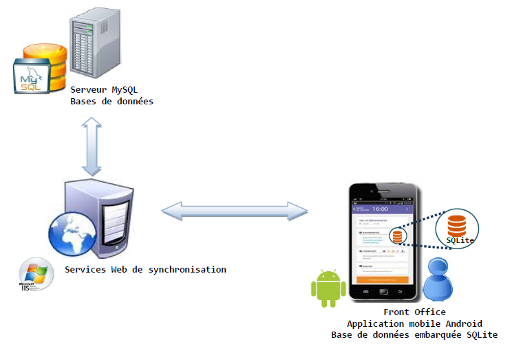
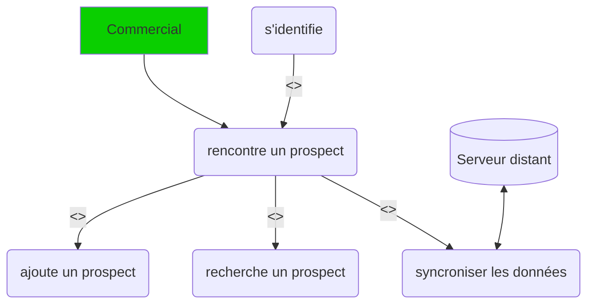

# Prospects Management

## Page de service

**^^Mises à jour^^**

|Version|Date       |Auteur         |Description du changement                                          |
|-------|-----------|---------------|-------------------------------------------------------------------|
| 1.0.0 |01-04-2022 |Marcel Lhote   |création                                                           |
|||||

**^^Diffusion^^**

|Version |Date       |Nom          |Rôle|
|--------|-----------|-------------|----|
|1.0.0   |03-04-2022 |Marcel Lhote |SLAM|
|||||

**^^Plan de classement :^^** SLAM4 ; Java ; Android ;  
**^^Niveau de confidentialité :^^** confidentiel

---

## Introduction

L'application à pour objectif d'ajouter des prospects. Lors de rencontres dans des salons ou autres vous serez amener à
enregistrer des contacts pour votre entreprise.  
Prospect Management intègre les fonctionnalités d'ajout de prospect et de synchronisation avec le serveur distant.

### Architecture

L'application intègre sa propre base de données SQLite pour enregistrer les prospects mêmes ors connexion.  
L'utilisateur peut Synchroniser avec le serveur lorsque ce dernier est accessible par le biais d'une requête api.

### Cas d'utilisation

Ce diagramme présente les fonctionnalités disponibles sur l'application

Lors d'une rencontre avec un prospect, le commercial doit se connecter pour accéder à son application.  
Ensuite, il pourra enregistrer la personne avec différentes informations (nous les verrons dans les pages
java un peu après), sinon il a la possibilité d'en rechercher un dans un tableau et dernièrement il peut synchroniser
les données avec un serveur distant (on récupère les prospects du serveur et on lui donne les prospects qu'on
a ajouté).

Dans le cas où le prospect existerait déjà, le serveur ne le rajoutera pas (on vérifie que son nom, prénom ainsi
que son entreprise ne soit pas les mêmes qu'un autre prospect existant).
