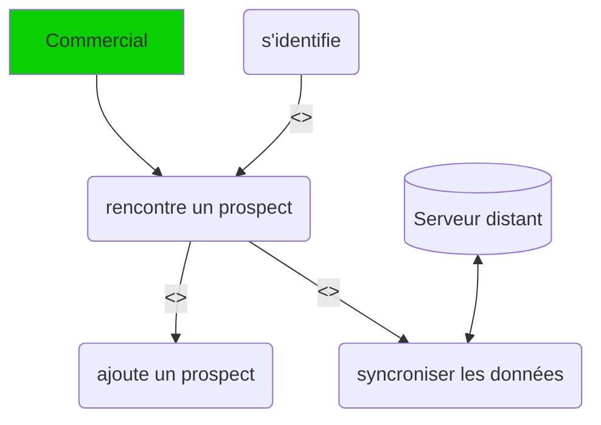

# Prospects Management

## Introduction

L'application à pour objectif d'ajouter des prospects. Lors de rencontres dans des salons ou autres vous serez amener à
enregistrer des contacts pour votre entreprise.  
Prospect Management intègre les fonctionnalités d'ajout de prospect et de synchronisation avec le serveur distant.

### Architecture

L'application intègre sa propre base de données SQLite pour enregistrer les prospects mêmes ors connexion.  
L'utilisateur peut Synchroniser avec le serveur lorsque ce dernier est accessible par le biais d'une requête api.

### Cas d'utilisation
Ce diagramme présente les actuels fonctionnalité pur l'application

