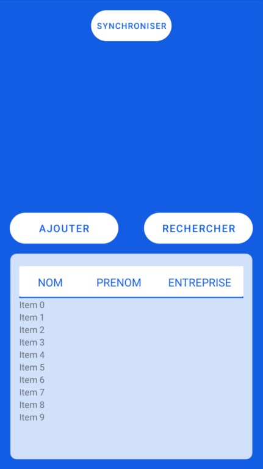
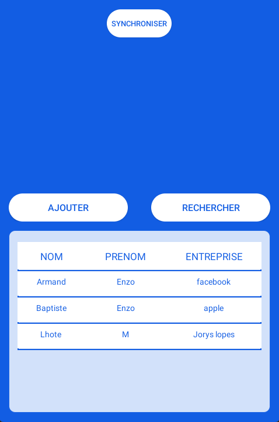
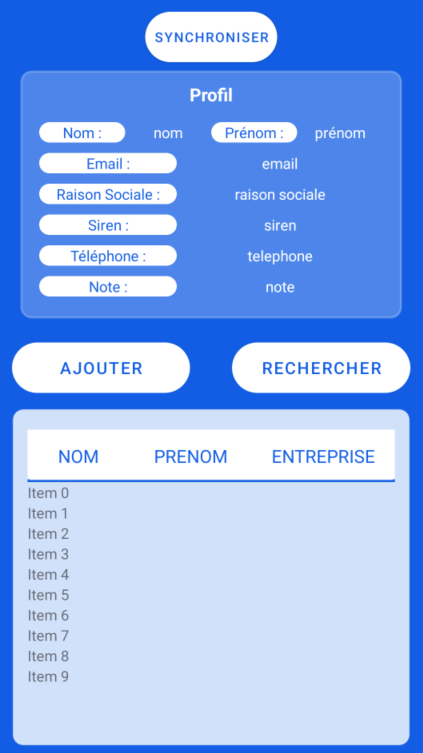
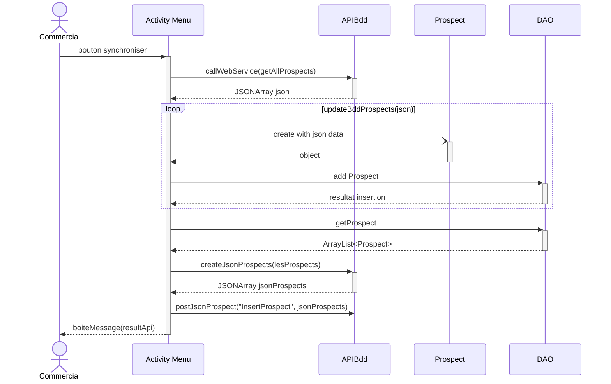

# Menu Activity

## Introduction
La classe `MenuActivity` permet d'avoir un aperçu des prospects avec une recherche par rapport à ceux-ci, ainsi que leurs informations en détails.
Elle permet aussi de synchroniser les données avec le serveur et d'accéder à la page d'ajout de prospect.
Le FrontEnd, layout principal qui lui est lié est intitulé `activity_menu`.

Aperçu depuis Android Studio avant lancement :



### Affichage des prospects et leurs détails

#### Affichage
Pour l'affichage des prospects nous avons besoin du layout `item_layout` et de la classe `ShowProspectAdaptater`.
Le xml `item_layout` contient uniquement une table avec une ligne et 3 colonnes représentés par des TextView, grâce à `ShowProspectAdaptater` 
nous allons pouvoir générer plusieurs lignes ayant pour design le xml cité juste avant.

La classe `ShowProspectAdaptater` est composée de 4 méthodes :

```java
	public class ViewHolder extends RecyclerView.ViewHolder{
        TextView nom_prospect, prenom_prospect, entreprise_prospect;
        TableRow row_prospect;
        public ViewHolder(@NonNull View itemView){
            super(itemView);

            nom_prospect = itemView.findViewById(R.id.nom_prospect);
            prenom_prospect = itemView.findViewById(R.id.prenom_prospect);
            entreprise_prospect = itemView.findViewById(R.id.entreprise_prospect);
            row_prospect = itemView.findViewById(R.id.tableRowProspect);
        }
    }
```

La première permet de mettre en place un ViewHolder qui hérite de `RecyclerView.ViewHolder`, on y appel ici les id des colonnes ainsi que de la ligne disponible
dans le xml `item_layout`.

```java
    @Override
    public int getItemCount() {
        if(prospectList != null){
            if (prospectList.size()<=5){
                return prospectList.size();
            }else{
                return 5;
            }
        }else{
            return 0;
        }
    }
```

La seconde va rechercher la taille de la liste de prospect c'est-à-dire combien de prospect sont existants, si le tableau prospectList est null alors
on va récupérer la valeur 0, si on en a moins ou 5 on en récupére la taille de la liste et sinon dans le cas où on en a plus de 5, on récupére 5.

```java
    @Override
    public void onBindViewHolder(@NonNull ShowProspectAdaptater.ViewHolder holder, int position) {
        if (prospectList != null && prospectList.size() > 0){
            Prospect model = prospectList.get(position);
            holder.nom_prospect.setText(model.getNom());
            holder.prenom_prospect.setText(model.getPrenom());
            holder.entreprise_prospect.setText(model.getRaisonSocial());

            holder.row_prospect.setOnClickListener(new View.OnClickListener() {
                @Override
                public void onClick(View v) {
                    holder.row_prospect.setBackgroundColor(Color.rgb(180,180,180));
                    interfaceClickable.setClick(position, prospectList);
                }
            });

        }else{
            return;
        }
    }
```	

La troisième quant à elle prend en paramètre deux choses, le ViewHolder créer auparavant ainsi qu'une position.
On va vérifier si la taille du tableau prospectList n'est pas null et si il est supérieur à 0 sinon on ne retourne rien.
Puis on créer un prospect "model" qui va prendre les informations du prospect dans le tableau qui est à la position prise en paramètre
pour ensuite stocké son nom, prénom, sa raison sociale dans des holders.

[Nous reviendrons sur le setOnClickListener dans la partie détail]

```java
    public ViewHolder onCreateViewHolder(@NonNull ViewGroup parent, int viewType) {
        View view = LayoutInflater.from(context).inflate(R.layout.item_layout,parent,false);
        return new ViewHolder(view);
    }
```	

Finalement un onCreateViewHolder avec en paramètre parent et viewType va affiché les prospects sur le menu.
En résultat par exemple avec 3 prospect, nous obtenons ceci :



#### Détails

Pour ce qui est de leurs détails, dans le xml correspondant à la page menu : `activity_menu` nous voyons au début de la page un grand carré bleu faisant la page vide, 
mais en faite il y a à cette place un LinearLayout caché grâce à la ligne `android:visibility="gone"` celui-ci a l'id : infosProspectLayout.
Il contient ceci :



Dès le début de la classe `MenuActivity`, dans le onCreate, nous avons une interface clicquable.

```java
	interfaceClickable = new onClickInterface() {
        TextView nomInfos = (TextView) findViewById(R.id.nomProspect);
        TextView prenomInfos = (TextView) findViewById(R.id.prenomProspect);
        TextView raisonSocialeInfos = (TextView) findViewById(R.id.raisonSocialeProspect);
        TextView sirenInfos = (TextView) findViewById(R.id.sirenProspect);
        TextView mailInfos = (TextView) findViewById(R.id.mailProspect);
        TextView telephoneInfos = (TextView) findViewById(R.id.telephoneProspect);
        TextView noteInfos = (TextView) findViewById(R.id.noteProspect);
        boolean visible;

        @Override
        public void setClick(int position, List<Prospect> lesProspects) {
            Prospect prospect = lesProspects.get(position);

            nomInfos.setText(prospect.getNom());
            prenomInfos.setText(prospect.getPrenom());
            raisonSocialeInfos.setText(prospect.getRaisonSocial());
            sirenInfos.setText(String.valueOf(prospect.getSiret()));
            mailInfos.setText(prospect.getMail());
            telephoneInfos.setText(prospect.getTel());
            noteInfos.setText(String.valueOf(prospect.getNotes()));

            if(infosProspectLayout.getVisibility() == View.GONE){
                visible = false;
            }else{
                visible = true;
            }

            filtresLayout.setVisibility(View.GONE);
            TransitionManager.beginDelayedTransition(infosProspectLayout);
            visible = !visible;
            infosProspectLayout.setVisibility(visible ? View.VISIBLE: View.GONE);
        }
    };
```	

Nous créons ici une interface clicquable c'est-à-dire que nous utilisons une interface nommé `onClickInterface` contenant uniquement ceci :

```java
	public interface onClickInterface {
		void setClick(int position, List<Prospect> lesProspects);
	}
```	

Qui a ici différent TextView correspondant aux informations détaillées des prospects ainsi qu'un booléen "visible" sans valeur.
Dès que l'on va cliquer sur celle-ci, nous allons obtenir la position du prospect dans la liste (tableau) lesProspects pour ajouter ensuite à 
l'intérieur des TextView les informations d'un prospect.
Le infosProspectLayout alors va avoir sa visibilité modifié, il va apparaitre ou disparaitre en fonction de si il est ou non présent, nous parlons
ici aussi d'un `filtresLayout` mais cela fait partie de la recherche de prospect.

Nous avions vu auparavant ce code ci-dessous

```java
	holder.row_prospect.setOnClickListener(new View.OnClickListener() {
    @Override
    public void onClick(View v) {
		interfaceClickable.setClick(position, prospectList);
        }
	});
```

Il met en place le fait que ce soit sur les lignes que nous allons cliquer grâce à l'interfaceClickable.

### Recherche de prospect


### Synchronisation avec le serveur externe
Ce diagramme de séquence représente la récupération des prospects depuis l'api au format json et de l'ajout en base de données local.
Et dans un second temps la récupération des prospects en base de données SQLite puis du formatage en json pour l'envoi au serveur.



L'évènement du bouton est déclaré dans `eventBtnSynchroniser`.  
La date de mise à jour permet de récupérer les prospects créer à une date ultérieure à celle de la mise à jour et donc limiter le nombres d'informations transmis en bande passante.  
Pour le POST : application envoie seulement les prospects pour lesquelles la valeur `isupdate` de la colonne est à false, il s'agit d'une valeur boolean pour savoir s'il le prospect est déjà synchronisé avec le serveur externe.  

```java
public View.OnClickListener eventBtnSynchroniser = new View.OnClickListener() {
        @Override
        public void onClick(View v) {
        loading.startLoadingDialog();

        SimpleDateFormat formatter  = new SimpleDateFormat("yyyy-MM-dd HH:mm:ss");
        formatter.setTimeZone(TimeZone.getTimeZone("UTC"));
        Date date = new Date();
        String dateMiseAjour = formatter.format(date);

        ApiBdd api = new ApiBdd();
        api.callWebService("getAllProspects.php?date="+lEmployee.getDateMiseAjour().replace(":","!"));
        JSONArray json = api.getJsonData();
        updateBddProspects(json);

        ArrayList<Prospect> lesProspects = dataBase.getProspectBdd().getProspects(null, null, null, false);//getAllProspects();

        if(lesProspects != null){
        JSONArray jsonProspects = api.createJsonProspects(lesProspects);
        api.postJsonProspect("insertProspect.php?date="+lEmployee.getDateMiseAjour().replace(":","!"), jsonProspects.toString());
        }
        lEmployee.setDateMiseAjour(dateMiseAjour);
        dataBase.getEmployeeBdd().update(lEmployee);

        loading.dismissDialog();
        boiteMessage(api.getResult());
        setRecyclerView(dataBase.getProspectBdd().getProspects(null,null,null, true));
        }
    };
```

Pour obtenir le bon format des données en json et mettre à jour le fichier SQLite la méthode `updateBddProspects` décompose l'objet et insert en bdd les prospects.  
Pour créer le format de données à envoyer on utilise la méthode `createJsonProspects(ArrayList<Prospect> lesProspects)`.

```java
/**
     * Formate une liste de prospect en json
     *
     * @param lesProspects ArrayList : la liste de prospects
     * @return JsonArray : les prospects au format json
     */
    public JSONArray createJsonProspects(ArrayList<Prospect> lesProspects) {
        //Creating a JSONObject object
        JSONArray jsonArray = new JSONArray();

        try {
            for (Prospect prospect : lesProspects) {
                JSONObject jsonObject = new JSONObject();
                //Inserting key-value pairs into the json object
                jsonObject.put("id", "default");
                jsonObject.put("nom", prospect.getNom());
                jsonObject.put("prenom", prospect.getPrenom());
                jsonObject.put("mail", prospect.getMail());
                jsonObject.put("tel", prospect.getTel());
                jsonObject.put("note", prospect.getNotes());
                jsonObject.put("siret", prospect.getSiret());
                jsonObject.put("raisonsocial", prospect.getRaisonSocial());

                jsonArray.put(jsonObject);
            }
        } catch (Exception e) {
            e.printStackTrace();
        }
        return jsonArray;
    }
```

Le bouton `Ajouter` change l'activité vers `AjoutProspectActivity`